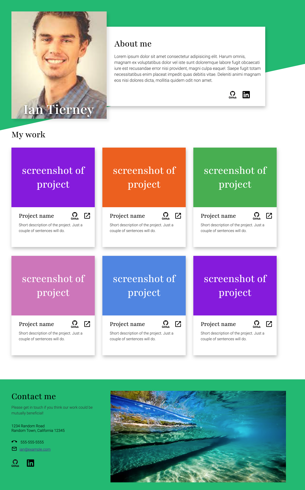
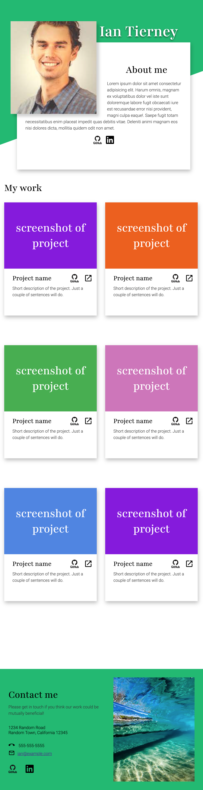
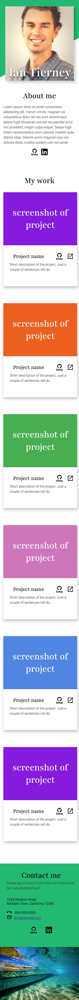

# Portfolio Project

This is a portfolio built using HTML and CSS. 

It was built using a mobile first design approach. 

The goal was to create a responsive page for mobile, tablet and laptop screen sizes. Effort was made to ensure that as the sizes change, the images, texts, and elements will not overflow or appear buggy. 

## Screenshots

### Desktop

### Tablet

### Mobile

## Attribution
This project was created with inspiration from The Odin Project via the Dev-Island Coding Bootcamp for Full-Stack Engineers. 